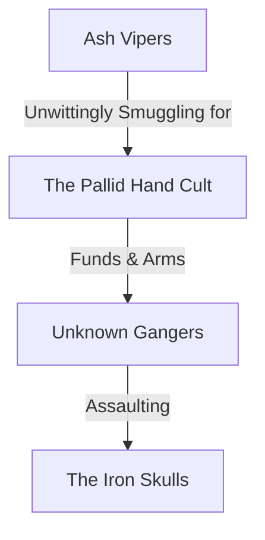

# Local Gangs (DM True Knowledge)

The true power dynamic behind the street-level gangs.

* **The Pallid Hand:** A Nurgle/Genestealer cult operating out of Hab Block 0F1C. They are using the "Unknown Gangers" as a front to seize the water purifiers to spread a contagion.
* **Ash Vipers:** They think they are smuggling Obscura, but they are actually moving tainted biomatter.
