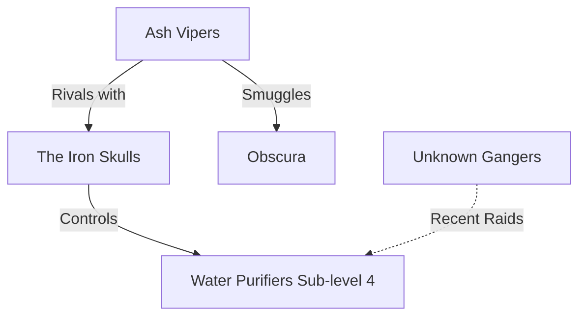

# Local Gangs (Surface Knowledge)

Known gang presence in this sector of the Underhive:

* **Iron Skulls:** Brutes who maintain the local water supply. Heavy weapons, low cunning.
* **Ash Vipers:** Fast, chem-addled hit-and-run tactics. 
* **Recent Activity:** Someone new is pressing the Skulls.
